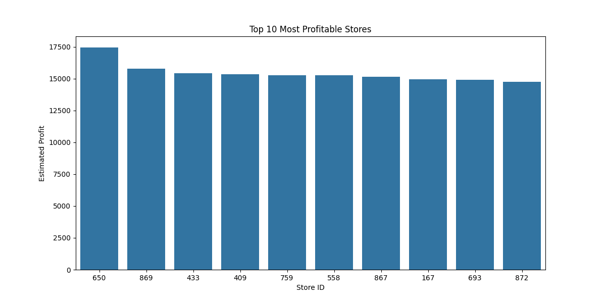
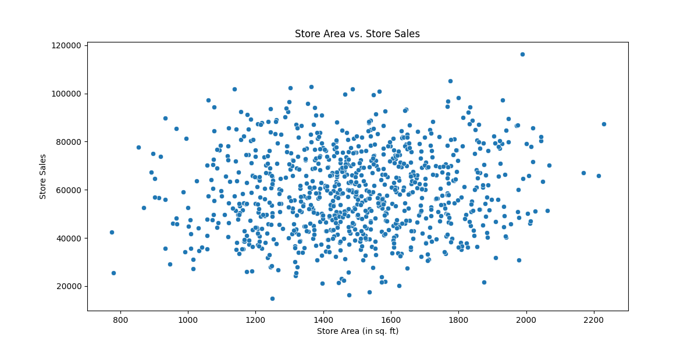
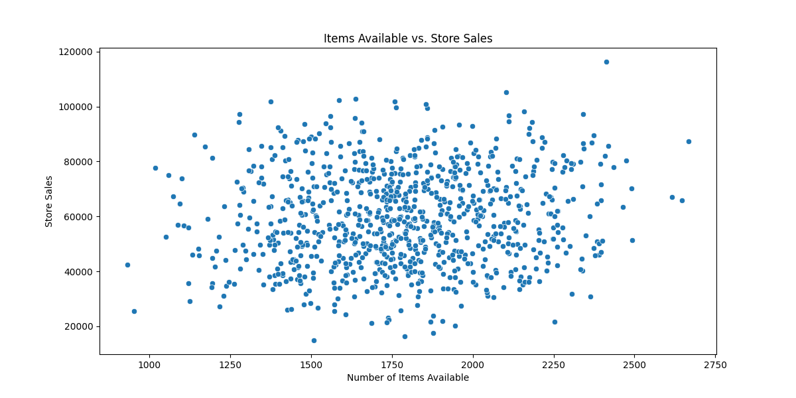

# 🛒 Retail Financial Performance Analysis using Python

 
 
 
 

---

## 📑 Table of Contents
- [📌 Project Overview](#-project-overview)  
- [📂 Dataset](#-dataset)  
- [🛠 Tech Stack](#-tech-stack)  
- [🔄 Project Workflow & Visualizations](#-project-workflow--visualizations)  
  - [1️⃣ Data Loading & Feature Engineering](#1️⃣-data-loading--feature-engineering)  
  - [2️⃣ Exploratory Data Analysis (EDA)](#2️⃣-exploratory-data-analysis-eda)  
    - [📈 Insight 1: Top 10 Most Profitable Stores](#-insight-1-top-10-most-profitable-stores)  
    - [🏬 Insight 2: Store Area vs Sales](#-insight-2-store-area-vs-sales)  
    - [📦 Insight 3: Product Variety vs Sales](#-insight-3-product-variety-vs-sales)  
- [💡 Key Findings & Recommendations](#-key-findings--recommendations)  
- [🚀 Conclusion](#-conclusion)  

---

## 📌 Project Overview
This project performs an in-depth financial analysis of a retail stores dataset.  
The goal is to identify key performance indicators, uncover sales trends, and provide actionable insights for business growth.  
It is framed as a performance review for a network of distributors of a major FMCG company like Nestlé India — showing how raw data can be transformed into business intelligence.

---

## 📂 Dataset
Dataset: Indian Stores Pincode Area and Sales Data (Kaggle)  
- 896 retail stores  
- Features: Store area, items available, daily customer count, total sales  

---

## 🛠 Tech Stack
- Language: Python  
- Libraries:  
  - 📑 Pandas → Data loading, cleaning, manipulation  
  - 📊 Matplotlib & Seaborn → Visualizations  

---

## 🔄 Project Workflow & Visualizations

### 1️⃣ Data Loading & Feature Engineering
- Loaded `Stores.csv` dataset  
- Created new metrics:  
  - Profit (15% profit margin assumption)  
  - Sales per Customer  

---

### 2️⃣ Exploratory Data Analysis (EDA)

#### 📈 Insight 1: Top 10 Most Profitable Stores
Bar chart showing top contributors to company profit.  

---

#### 🏬 Insight 2: Store Area vs Sales
Scatter plot showing correlation between store size and sales.  

---

#### 📦 Insight 3: Product Variety vs Sales
Scatter plot showing link between product variety and sales.  

---

## 💡 Key Findings & Recommendations

| Finding | Recommendation |
|---------|----------------|
| A small subset of stores (Top 10) generate a significant share of profit | Build strategic partnerships with these stores → better margins, joint marketing |
| Moderate positive correlation between store area and sales, but small stores can also perform well | Study high-performing small stores → replicate strategies across the network |

---

## 🚀 Conclusion
This project highlights how data-driven insights can guide decision-making in retail distribution.  
It provides a roadmap for identifying profitable partners, optimizing store strategies, and ensuring sustainable growth.  
